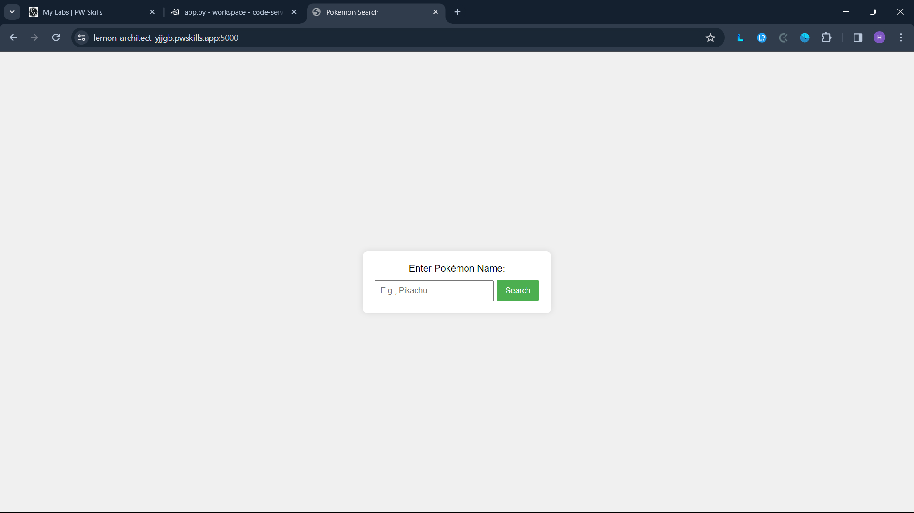

# Flask Pokemon API Project

This is a simple Flask web application that allows users to retrieve information about a Pokemon by entering its name. The application uses the [PokeAPI](https://pokeapi.co/) to fetch data about the specified Pokemon and displays its base stats along with a sprite image.

## Screenshots

